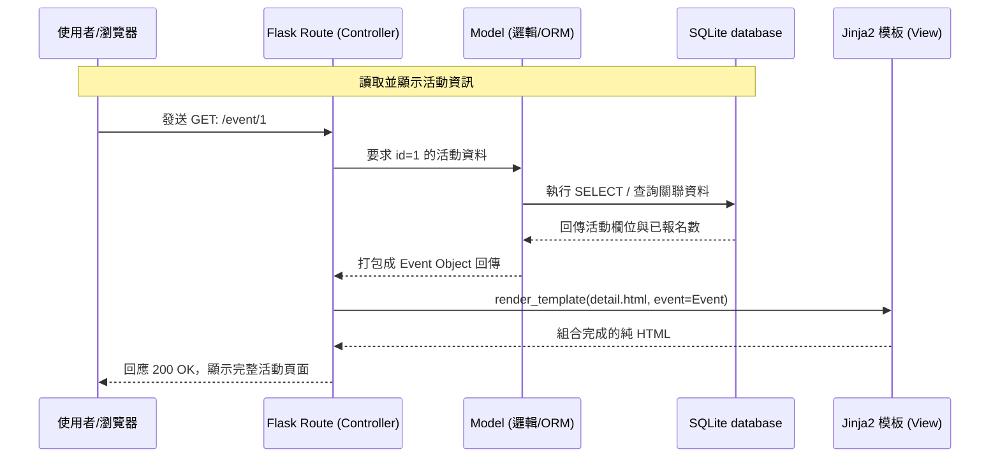

# 系統架構文件 (Architecture) - 活動報名系統

本文檔依據 `docs/PRD.md` 中的功能需求所設計，確立專案使用的技術架構、資料夾結構定義以及各元件間的職責與關係。

## 1. 技術架構說明

本系統採用傳統且穩定的後端渲染 MVC（Model-View-Controller）模式，不進行前後端分離，以求快速構建。

* **選用技術與原因：**
  * **後端架構：Python + Flask**
    * Flask 是一個輕量級的 Web 框架，適合快速開發與 MVP，開發者能高度掌握結構。
  * **模板引擎：Jinja2**
    * Flask 預設內建的模板引擎，能在伺服器端直接處理資料並渲染成 HTML 頁面。不僅能加快開發速度、免去制定大量內部 API，也對初始的 SEO 更加友善。
  * **資料庫：SQLite**
    * 不需要架設獨立伺服器，對管理規模尚小的活動、報名者資訊非常方便，輕量且與 Python 標準庫完美結合。

* **Flask MVC 模式說明：**
  * **Model（模型）**：負責與 SQLite 互動，封裝資料存取邏輯。如：「新增活動紀錄」、「計算剩餘名額」、「寫入一筆報名資料」。
  * **View（視圖）**：負責畫面渲染，此處對應 Jinja2 模板（如 `event_detail.html`），將 Controller 傳來的資料整合出使用者看到的網頁。
  * **Controller（控制器）**：即 Flask 的 Routes 功能。接收瀏覽器送出的 URL Request，到 Model 拿取/異動資料後，再呼叫 Jinja2 模板渲染畫面並回傳給用戶。

## 2. 專案資料夾結構

專案以簡單、明確為原則，其目錄結構如下：

```text
web_app_development/
├── app/                  # 應用程式的核心邏輯區塊
│   ├── models/           # [Model] 資料庫的 ORM 與架構定義
│   │   └── models.py     # 描述 Event (活動) 與 Registration (報名者)
│   ├── routes/           # [Controller] 集中管理各種路徑邏輯
│   │   └── routes.py     # 如 /create, /event/<id>, /book 等功能
│   ├── templates/        # [View] Jinja2 的 HTML 網頁樣本
│   │   ├── base.html     # 共用版型（Header、Footer 與共用引用資源）
│   │   ├── index.html    # 首頁（活動列表）
│   │   ├── create.html   # 建立活動的表單頁面
│   │   └── detail.html   # 單一活動說明與報名的頁面
│   └── static/           # 靜態資源存放區
│       ├── css/
│       │   └── style.css # 系統的視覺樣式
│       └── js/
│           └── script.js # 前端輔助腳本（如表單驗證等）
├── instance/             # 獨立不受版本控制之特定環境資源
│   └── database.db       # SQLite 資料庫儲存檔
├── docs/                 # 各類文件存放區
│   ├── PRD.md            # 產品需求文件
│   └── ARCHITECTURE.md   # 系統架構文件（本檔）
├── app.py                # 整個應用程式主程式入口 (Entry Point)
└── requirements.txt      # 專案相依性列表（Flask 等套件版本）
```

## 3. 元件關係圖

以下展示使用者發起動作時，這套系統內的資料走向：



## 4. 關鍵設計決策

1. **Jinja2 Server-Side Rendering (SSR)**
   選擇直接用 Jinja2 吐出組好的 HTML，代替將系統拆成「純前端 SPA」與「純後端 API」。這樣不只能省下配置跨域與狀態管理的心力，對於單純表單輸入性質的「活動系統」，其開發體驗與成果都是最佳的。
2. **Model 資料處理集中化**
   所有跟資料表對談的邏輯，無論是讀取或修改，都不直接寫在 Route 中，而是拉出來利用 function 或是 ORM 處理。這麼做能確保 Route 程式碼輕盈，專注在「收請求、回網頁」，讓系統容易維護。
3. **併發與額滿控制機制 (Concurrency Control)**
   活動報名最大的難點在於極多數人同時間搶位可能造成的超賣。本架構在 Model 寫入 Registration 前，會建立資料庫層級的 Transaction。只要發現資料庫當下可容納人數 `= 0`，則主動攔截、復原操作並透過 Route 將錯誤呈現於頁面。
