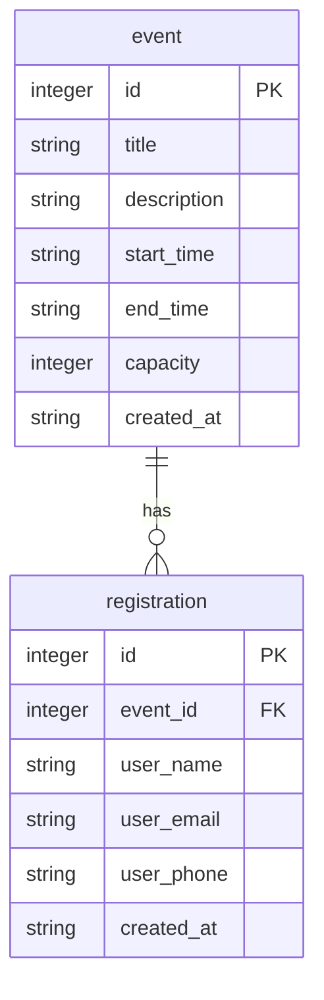

# DB Design - 資料庫設計文件

本文檔說明活動報名系統的資料庫的結構、關聯與相關 Python Model 設計。

## 1. ER 圖（實體關係圖）



## 2. 資料表詳細說明

### event (活動表)
記錄主辦方建立的活動詳細資訊與人數限制。

| 欄位名稱 | 型別 | 必填 | 預設或條件 | 說明 |
| --- | --- | --- | --- | --- |
| id | INTEGER | 是 | PK, AUTOINCREMENT | 自動遞增唯一的活動 ID |
| title | TEXT | 是 | - | 活動名稱 |
| description | TEXT | 否 | - | 活動的詳細簡述與說明文字 |
| start_time | TEXT | 是 | - | 活動開始時間 (建議使用 ISO 8601 格式字串) |
| end_time | TEXT | 是 | - | 活動結束時間 (建議使用 ISO 8601 格式字串) |
| capacity | INTEGER | 是 | - | 活動名額上限總數 |
| created_at | TEXT | 是 | CURRENT_TIMESTAMP | 此活動紀錄的建立時間 |

### registration (報名表)
記錄參加者的報名資料，以及對應到哪一場活動。

| 欄位名稱 | 型別 | 必填 | 預設或條件 | 說明 |
| --- | --- | --- | --- | --- |
| id | INTEGER | 是 | PK, AUTOINCREMENT | 自動遞增唯一的報名紀錄 ID |
| event_id | INTEGER | 是 | FK | 參考至 event 資料表之 id |
| user_name | TEXT | 是 | - | 報名者姓名 |
| user_email | TEXT | 是 | - | 報名者電子郵件 |
| user_phone | TEXT | 否 | - | 報名者聯絡電話 |
| created_at | TEXT | 是 | CURRENT_TIMESTAMP | 報名時間 (建立紀錄時間) |

## 3. SQL 建表語法

請參考 `database/schema.sql`，也可以從下方直接檢視完整的 SQLite 建表語法：

```sql
CREATE TABLE IF NOT EXISTS event (
    id INTEGER PRIMARY KEY AUTOINCREMENT,
    title TEXT NOT NULL,
    description TEXT,
    start_time TEXT NOT NULL,
    end_time TEXT NOT NULL,
    capacity INTEGER NOT NULL,
    created_at TEXT DEFAULT CURRENT_TIMESTAMP
);

CREATE TABLE IF NOT EXISTS registration (
    id INTEGER PRIMARY KEY AUTOINCREMENT,
    event_id INTEGER NOT NULL,
    user_name TEXT NOT NULL,
    user_email TEXT NOT NULL,
    user_phone TEXT,
    created_at TEXT DEFAULT CURRENT_TIMESTAMP,
    FOREIGN KEY (event_id) REFERENCES event (id)
);
```

## 4. Python Model 程式碼
系統使用原生的 `sqlite3` 庫與資料庫互動以實現 MVC 之中的 Model 層。
各 Model 均實作了相關的 CRUD 方法，並且放置於 `app/models/` 之中：
- `app/models/event.py`
- `app/models/registration.py`
