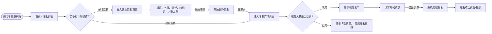
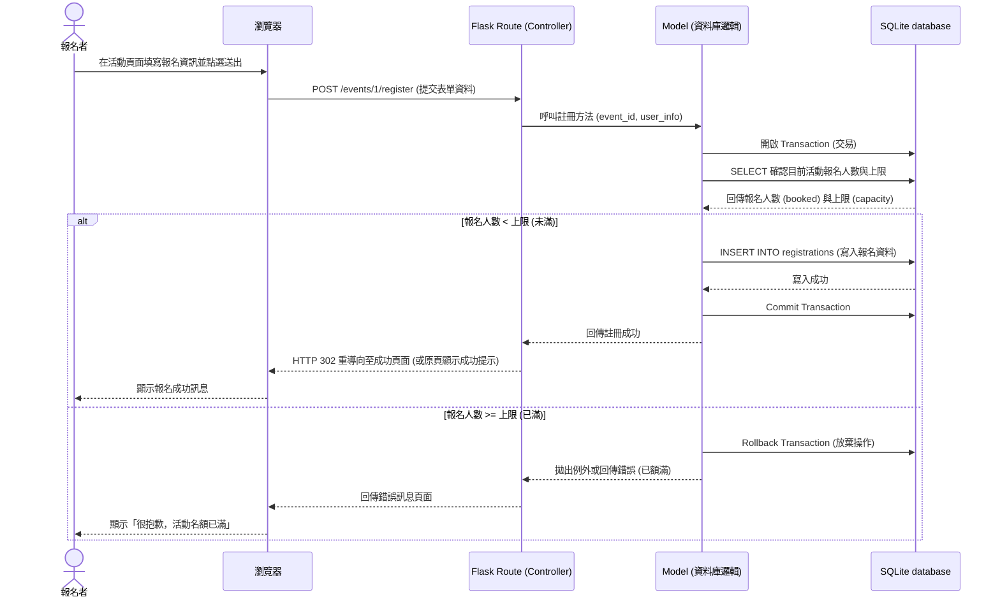

# 流程圖文件 (Flowchart) - 活動報名系統

本文檔依據 `docs/PRD.md` 的功能需求與 `docs/ARCHITECTURE.md` 的架構設計，將系統操作邏輯與資料流轉換為視覺化流程圖，以便後續的開發與除錯。

## 1. 使用者流程圖（User Flow）

此流程圖描述「活動創辦者」與「報名者」進入系統後的主要操作路徑與分支條件。

## 2. 系統序列圖（Sequence Diagram）

此序列圖詳細描述報名者「送出報名表單」直到「資料存入資料庫」的完整過程。為了確保不超賣，這個階段會包含名額的檢查。

## 3. 功能清單與路徑對照表

根據上述流程，將功能整理成對應的 URL 路由（URL Route）與 HTTP 方法（HTTP Method）：

| 功能名稱 | 對應路徑 (URL) | HTTP 方法 | 說明 |
| --- | --- | --- | --- |
| 瀏覽活動列表 | `/` 或 `/events` | GET | 首頁，列出近期或是系統內所有建立的活動。 |
| 建立活動頁面 | `/events/create` | GET | 顯示填寫「新增活動」的空白表單。 |
| 送出建立活動 | `/events/create` | POST | 接收建立表單的資料並存入資料庫，成功後重導。 |
| 瀏覽活動詳情 | `/events/<id>` | GET | 顯示單一活動內容（含簡述、時間表、目前報名人數），判斷並顯示報名表單。 |
| 送出報名資料 | `/events/<id>/register` | POST | 接收報名者資訊，進行名額檢查後存入資料庫，額滿則拒絕。 |
